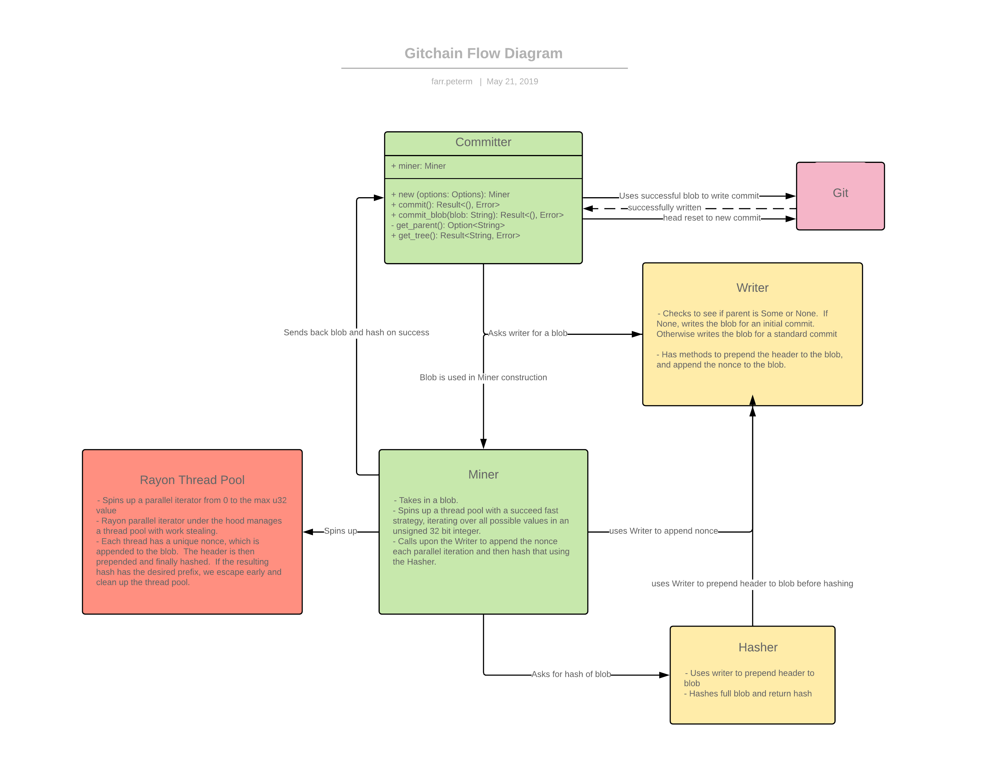
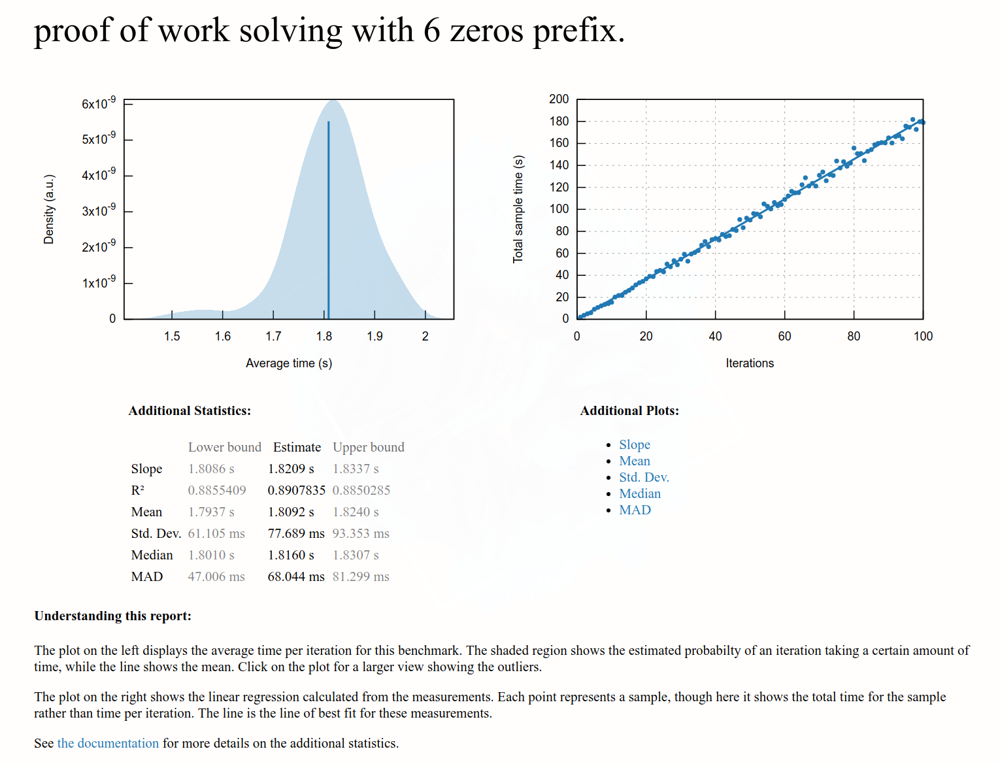

# Gitchain

[](https://prismaphonic.github.io/gitchain/gitchain/index.html)

Gitchain is a tool that will issue git commits with custom hash prefixes. The default prefix
is 000000 (six zeroes), but can be adjusted by passing in the -p or --prefix flag with a custom
prefix.

## Methodology

Gitchain works very similarly to how blockchain miner's operate.  When you issue a commit using
gitchain, in the process you create a miner.  A miner will try to hash your commit along with
an incrementing value called a `nonce`. This random value is appended to the end of the commit, causing the
hash to change.  Once a `nonce` has been discovered which when hashed with the commit causes the
resulting hash to have the desired prefix, the miner will return the resulting blob (commit contents)
which will include the nonce in it.

The committer will then use this to issue the desired commit with the correct hash.

For more details about the flow of data in the application:



## Install

To install this program globally, `cd` into the `gitchain-tool` folder and run:

```console
$ cargo install --path .
```

If you do not have cargo installed, simply follow these install instructions.

[Rust & Cargo installation](https://rustup.rs/)

## Use

This terminal application was designed to be interactive and like most shell applications you can
ask it directly for help.

That being said let's go over the commands you can use with `gitchain`.

### Add

The add subcommand is simply a passthrough to `git add` and is a convenience method.  Use it exactly
how you would use `git add`:

```console
$ gitchain add .
```

### Commit

If you would like to issue a git commit that will have a custom prefix of `000000`, simply use
`gitchain` the same way you would use `git`:

```console
$ gitchain commit -m "Commit message."
```

This assumes that you have files staged for commiting.  Please use the `add` subcommand if you do not.

You can pass in a custom hash prefix as well:

```console
$ gitchain commit -p 010101 -m "Commit message."
```

By default `gitchain` will use the current directory as the root directory for the git repo.
If you would like to supply an alternate path, simply pass it using the -r or --repository flag:

```console
$ gitchain commit -r ~/git/custom_folder -m "Commit message"
```

## Testing

To run tests simply change into the root directory for the crate and run:

```console
$ cargo test
```

The integration test is currently set to ignore.  To run it simply pass the ignored flag:

```console
$ cargo test -- --ignored
```

## Benchmarking

To run criterion benchmarks simply cd into the root directory and run:

```console
$ cargo bench
```

In my testing on my personal computer I found that average solve time for six zeroes was 1.8 seconds.

**WARNING: CRITERION WILL RUN 5050 LOOP ITERATIONS WITH A WARM UP PHASE.  THIS IS AN EXTREMELY
LONG BENCHMARK TO GET A STATISTICAL AVERAGE THAT IS MEANINGFUL**

## Performance Data

After running criterion for roughly 2 hours on a six zero prefix test, I got the following results:



License: MIT
